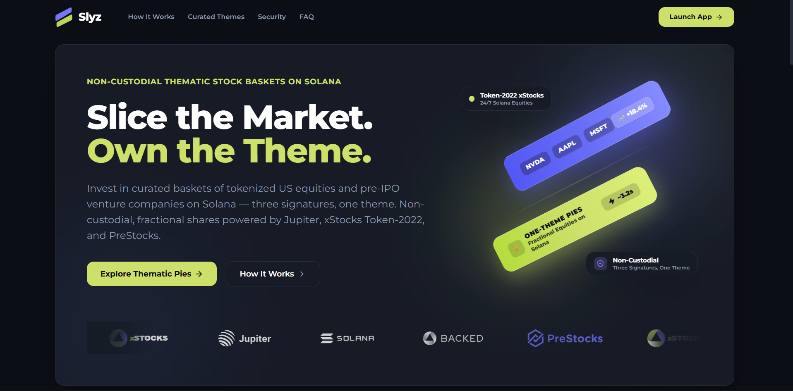
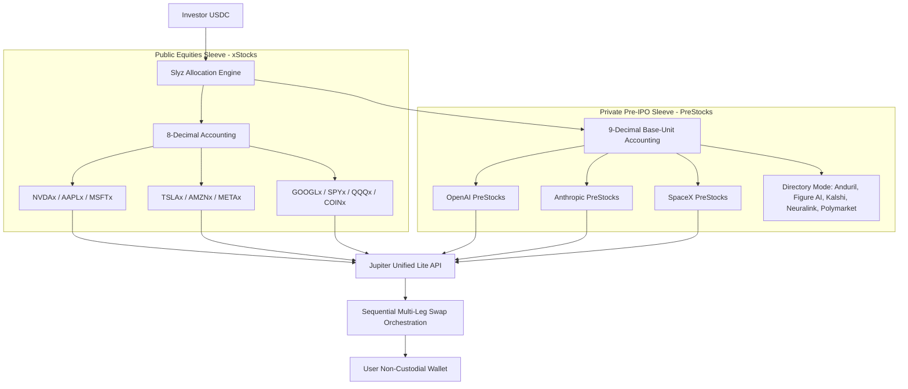

<div align="center">
  
  <h1>Slyz ⚡</h1>
  <p><strong>Slice the Market. Own the Theme.</strong></p>
  <p><em>Non-custodial, fractional thematic stock basket investing on Solana powered by xStocks, PreStocks, and Jupiter.</em></p>

  <p>
    <a href="https://useslyz.vercel.app"></a>
    
    
    
    
  </p>
</div>

---

<div align="center">
  
</div>

---

## 📌 Overview

**Slyz** is a non-custodial, consumer-grade thematic stock basket investing protocol on Solana. Rather than researching isolated tickers and manually executing fragmented trades across disparate liquidity pools, investors can select curated thematic baskets (or assemble custom portfolios in the Slyz Studio), input a single dollar amount in USDC, and acquire fractional shares of tokenized equities with automated drift tracking, smart top-up rebalancing, and one-click exit liquidation.

Slyz bridges public US equities and private venture markets through an elegant **Dual-Sleeve Architecture** natively engineered for the Solana Token-2022 standard.

---

## 🏛️ Dual-Sleeve Architecture



### 1. Public Equities Shelf (xStocks)
- **10 Verified Equities**: Apple (`AAPLx`), Microsoft (`MSFTx`), Nvidia (`NVDAx`), Tesla (`TSLAx`), Amazon (`AMZNx`), Alphabet (`GOOGLx`), Meta (`METAx`), S&P 500 (`SPYx`), Nasdaq 100 (`QQQx`), Coinbase (`COINx`).
- **Token Standard**: 8-decimal Token-2022 tokens issued via Backed Finance.
- **24/7 On-Chain Liquidity**: Live pricing, real-time multi-stock trend charts, and on-chain swap routing powered by Jupiter.

### 2. Private Pre-IPO Shelf (PreStocks)
- **Verified Mint Addresses**: 100% verified contract addresses sourced directly from the official PreStocks API (`https://prestocks.com/api/prestocks`). Zero placeholder or unverified assets.
- **9-Decimal Precision**: Native handling of 9-decimal Token-2022 tokens with string-based integer conversion to eliminate floating-point dust.
- **Frontier Basket**: Instant multi-asset exposure to Silicon Valley's top private giants:
  - **OpenAI PreStocks** (40%)
  - **Anthropic PreStocks** (35%)
  - **SpaceX PreStocks** (25%)
- **Impact Guard (<5%)**: Live Jupiter pool gating ensures orders only execute when liquidity depth has less than 5% price impact. Presets are capped at $25 to ensure optimal execution.
- **3-Tier Failover Resilience**:
  1. *Live Feed*: The browser polls our own same-origin proxy route `/api/prestocks` every 30s. That route server-side fetches `https://prestocks.com/api/prestocks` and caches the payload for 60s. (The upstream sends no CORS headers, so a direct browser call to it is blocked — the proxy is required.)
  2. *Local Storage Cache*: Automatically preserves the last successful payload in `localStorage` (`slyz_prestocks_last_payload`) if the API is unreachable.
  3. *Authentic Snapshot*: Static fallback strictly matches official marks and valuations.

---

## ⚡ Core Protocol Features

- 🎯 **One-Click Thematic Execution**: Select a theme, enter an amount in USDC, and let the sequential engine execute all underlying swaps in isolated transactions.
- 🛠️ **Custom Slyz Studio**: Interactive portfolio sandbox allowing users to handpick 2 to 4 public equities with auto-normalizing allocation sliders and dynamic SVG Donut chart visualization.
- ⚖️ **Smart Top-Up Rebalancing**: Water-filling algorithm that routes 100% of new deposits into underweight assets to restore target weights with **zero sell fees, zero tax events, and zero sell slippage**.
- 🚪 **Exit to USDC Liquidation**: Complete or partial exit functionality that sequentially liquidates all held tokens back into USDC in real time.
- 📈 **Real-Time Drift Tracker**: Reads live Token-2022 program accounts directly from Solana Mainnet, calculating current value, cost basis, unrealized PnL, and allocation drift against target weights.
- 📱 **Mobile-First Responsive Interface**: Full mobile support including WalletConnect / Reown Cloud relay and Solana Mobile Wallet Adapter (MWA) with adaptive dark styling.

---

## 🥧 Curated Thematic Baskets

| Basket | Shelf | Composition | Thesis |
|---|---|---|---|
| **The Mag 3** | Public (xStocks) | NVDA (40%), AAPL (30%), MSFT (30%) | The core trilateral engine of mega-cap enterprise tech and mobile compute. |
| **The Index** | Public (xStocks) | SPY (50%), QQQ (30%), AAPL (20%) | Broad US market and large-cap tech index blend for foundational stability. |
| **AI Frontier** | Public (xStocks) | NVDA (40%), MSFT (30%), GOOGL (30%) | Full-stack artificial intelligence exposure across compute, hyperscalers, and models. |
| **High Beta** | Public (xStocks) | TSLA (40%), NVDA (30%), COIN (30%) | High-volatility basket capturing tech momentum, next-gen mobility, and crypto infrastructure. |
| **Big Commerce** | Public (xStocks) | AMZN (40%), META (30%), GOOGL (30%) | Dominant digital ad monopolies and global logistics platforms. |
| **Frontier** | Private (PreStocks) | OpenAI (40%), Anthropic (35%), SpaceX (25%) | Direct economic exposure to the world's most valuable private technology companies. |

---

## 🛠️ Technology Stack

- **Frontend & App Router**: [Next.js 14](https://nextjs.org/) (React 18, TypeScript)
- **Styling**: [Tailwind CSS](https://tailwindcss.com/) with Custom Design System (Obsidian `#0B0E14`, Volt Lime `#CDE06A`, Periwinkle `#8D8AFF`)
- **Charts & Visualizations**: [Recharts](https://recharts.org/) + SVG Donut Allocator
- **Solana Web3**: `@solana/web3.js` & `@solana/spl-token` (Token-2022 Account Parsing)
- **Wallet Standard**: `@solana/wallet-adapter-react` (Phantom, Solflare, Backpack, Mobile Wallet Adapter, Reown Cloud)
- **DEX Aggregator**: [Jupiter Swap Unified Lite API](https://lite-api.jup.ag)
- **Private Equities Data**: [PreStocks REST API](https://prestocks.com/api/prestocks)
- **RPC Infrastructure**: Dedicated Alchemy Solana Mainnet RPC

---

## 🚀 Getting Started

### 1. Prerequisites
- **Node.js**: v18.17.0 or v20.x
- **npm** or **yarn** / **pnpm**
- A Solana wallet (e.g. Phantom, Solflare) funded with SOL and USDC.

### 2. Clone the Repository
```bash
git clone https://github.com/Cryptojigi/slyz.git
cd slyz
```

### 3. Install Dependencies
```bash
npm install --ignore-scripts
```

### 4. Configure Environment Variables
Create a local `.env.local` file from the provided example:
```bash
cp .env.example .env.local
```

Configure your environment variables:
```env
# Primary Dedicated Solana RPC (e.g., Alchemy Solana Mainnet)
# NOTE: Slyz uses a SINGLE RPC — there is no fallback provider. The Alchemy app
# MUST allowlist the deployed origin (e.g. https://useslyz.vercel.app), otherwise
# both balance reads and transaction sends will fail.
NEXT_PUBLIC_ALCHEMY_RPC_URL=https://solana-mainnet.g.alchemy.com/v2/YOUR_ALCHEMY_KEY

# Public Site URL (used for metadata and wallet origin verification)
NEXT_PUBLIC_APP_URL=https://useslyz.vercel.app

# Solana Cluster
NEXT_PUBLIC_SOLANA_NETWORK=mainnet-beta

# Jupiter Swap Unified Lite API
NEXT_PUBLIC_JUPITER_API_URL=https://lite-api.jup.ag

# WalletConnect / Reown Cloud Project ID (Optional - for mobile QR/deep links)
NEXT_PUBLIC_WC_PROJECT_ID=YOUR_REOWN_PROJECT_ID

# PreStocks Server-Side Proxy Upstream (Optional override, defaults to https://prestocks.com/api/prestocks)
PRESTOCKS_API_URL=https://prestocks.com/api/prestocks
```

### 5. Run the Development Server
```bash
npm run dev
```
Open [http://localhost:3000](http://localhost:3000) in your browser.

### 6. Production Build
```bash
npm run build
npm run start
```

---

## 🔒 Security & Non-Custodial Architecture

1. **Zero Custody**: Slyz never holds user funds or private keys. All transactions are compiled on the client and signed directly through the user's wallet.
2. **Atomic Token-2022 Interactions**: All equity balances are held as standard Token-2022 SPL accounts in the user's own Solana wallet address.
3. **Dedicated RPC Routing**: Multi-step swaps are routed through dedicated RPC nodes with fallback capabilities to prevent rate-limiting and transaction simulation drops.
4. **Impact Guard & Liquidity Limits**: PreStocks purchases are protected with hardcoded slippage guards and order caps ($25) to defend against thin automated market maker pools.

---

## 📄 License

Distributed under the MIT License. See `LICENSE` for more information.

---

<div align="center">
  <p>Built with ⚡ for the Solana Ecosystem.</p>
</div>
