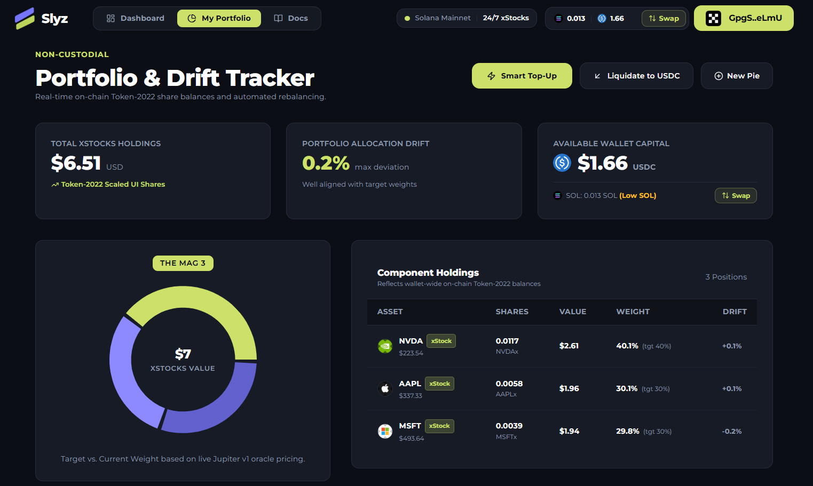

<div align="center">
  
  <h1>Slyz</h1>
  <p><strong>Slice the Market. Own the Theme.</strong></p>
  <p><em>Non-custodial thematic stock basket investing, Pre-IPO stock access, and on-chain stock gifting -- all on Solana.</em></p>

  <p>
    <a href="https://useslyz.vercel.app"></a>
    
    
    
    
    
  </p>
</div>

---

<div align="center">
  
</div>

---

## The Problem

Investing in stocks on-chain today is fragmented, confusing, and impractical for most people:

1. **No easy way to invest thematically.** You want exposure to "AI" or "Big Tech" as a theme, but you're forced to research individual tickers, find the right tokenized versions, and execute separate swap transactions for each one. On traditional brokerages this takes a few clicks; on-chain it takes dozens.

2. **Pre-IPO companies are completely inaccessible.** OpenAI, SpaceX, Anthropic -- the most valuable private technology companies in the world -- are off-limits to ordinary investors. Even on-chain, the tokens exist ([PreStocks](https://prestocks.com) has tokenized them on Solana), but there's no consumer-grade app that integrates them alongside public equities, handles their unique 9-decimal precision, resolves their live pricing, or protects users from thin AMM liquidity. The raw tokens sit there, untouchable by anyone who doesn't want to manually interact with DEX aggregators and manage Token-2022 quirks by hand.

3. **You cannot gift stocks to anyone.** On traditional platforms, stock gifting is either impossible or buried behind account-level restrictions. On-chain, it's even worse. Want to send a friend $50 in SpaceX shares for their birthday? You'd have to walk them through setting up a Solana wallet, funding it with SOL, finding the right Token-2022 mint address, navigating a DEX, and executing a swap -- all before they can own a single share. There is no "send a link, they click claim" experience. It doesn't exist.

4. **Rebalancing is a nightmare.** When your portfolio drifts from target weights, the only option is manual selling and re-buying -- creating taxable events, paying swap fees twice, and losing to slippage on every trade.

5. **Token-2022 complexity is hidden but dangerous.** Many tokenized stocks use Solana's Token-2022 standard with features like transfer fees (1% withheld on every PreStocks transfer) and scaled UI multipliers that change over time. If an app doesn't handle these correctly, users silently lose money -- receiving fewer shares than expected, or having claims fail entirely because the vault math is wrong.

---

## What Slyz Solves

**Slyz is a non-custodial web app that lets anyone invest in curated stock baskets, access pre-IPO companies, and gift fractional shares to friends -- all on Solana, with a few clicks.**

- **Pick a theme, enter an amount, done.** Select "AI Frontier" or "The Mag 3", type `$50`, and Slyz automatically splits your USDC across 3 stocks, executes each swap through Jupiter, and deposits the tokenized shares directly into your wallet.

- **Access pre-IPO companies that were previously unreachable.** Slyz is the first consumer app to properly integrate PreStocks tokens -- bringing OpenAI, Anthropic, SpaceX, Anduril, Figure AI, Kalshi, Neuralink, and Polymarket into a single unified interface with live pricing, fractional share support, and full Token-2022 transfer fee handling.

- **Gift any stock -- public or pre-IPO -- to anyone with a link.** Slyz introduces the first on-chain stock gifting system on Solana. Send fractional shares of Tesla, SpaceX, or OpenAI as an expiring claim link. The recipient just connects their wallet and clicks "Claim." No prior setup needed. No fees for the recipient.

- **Rebalance without selling.** Water-filling algorithm routes 100% of new deposits into underweight assets. Zero sells, zero extra tax events, zero unnecessary slippage.

- **Token-2022 math done right.** Slyz dynamically reads each token's on-chain capabilities and accounts for them everywhere: investing, gifting, claiming, reclaiming, and display.

---

## PreStocks Integration -- Bringing Pre-IPO to Everyone

### What is PreStocks?

[PreStocks](https://prestocks.com) is a protocol on Solana that tokenizes ownership in the world's most valuable private companies. Each PreStocks token represents fractional exposure to a pre-IPO company, minted as a Token-2022 asset with 9-decimal precision and a 1% (100 basis points) transfer fee enforced at the protocol level.

These aren't synthetic derivatives or price feeds. They are on-chain tokens with real supply, real liquidity pools on Jupiter, and real market prices that reflect secondary-market valuation of these private companies.

### Why the Integration Matters

Before Slyz, using PreStocks tokens meant:
- Finding the correct mint address manually (8 separate contracts, each starting with `Pre...`)
- Knowing that PreStocks uses 9 decimal places (not 8 like xStocks) and doing the math yourself
- Understanding that every transfer silently withholds 1% via Token-2022's `transferFeeConfig` extension
- Dealing with `scaledUiAmountConfig` multipliers that change over time (OpenAI's multiplier is currently ~1.486, meaning 1 "display share" does not equal 1 raw token)
- Checking Jupiter liquidity depth manually before placing an order, because thin AMM pools can cause 10%+ slippage
- Having no live pricing dashboard -- the PreStocks API exists, but it doesn't serve CORS headers, so browsers can't read it directly

Slyz solves every one of these problems.

### How We Integrated PreStocks

**1. Verified Mint Registry**

All 8 PreStocks mint addresses are sourced directly from the official PreStocks API (`https://prestocks.com/api/prestocks`) and hardcoded with their verified contract addresses, decimal precision (9), transfer fee (100 bps), and scaled UI multipliers:

| Asset | Mint Address | Multiplier | Transfer Fee |
|---|---|---|---|
| OpenAI | `PreweJYECqtQwBt...` | 1.4861347 | 1% (100 bps) |
| Anthropic | `Pren1FvFX6J3E4k...` | 1.0 | 1% (100 bps) |
| SpaceX | `PreANxuXjsy2pvi...` | 5.0 | 1% (100 bps) |
| Anduril | `PresTj4Yc2bAR19...` | 1.0 | 1% (100 bps) |
| Figure AI | `PreZad18qfPtbxN...` | 1.0 | 1% (100 bps) |
| Kalshi | `PreLWGkkeqG1s4H...` | 1.0 | 1% (100 bps) |
| Neuralink | `PrekqLJvJ3qVdXm...` | 1.0 | 1% (100 bps) |
| Polymarket | `Pre8AREmFPtoJFT...` | 1.0 | 1% (100 bps) |

**2. Server-Side CORS Proxy**

The upstream PreStocks API (`prestocks.com/api/prestocks`) returns valid JSON but sends no `Access-Control-Allow-Origin` header. Browsers block it outright. Slyz runs a Next.js API route (`/api/prestocks`) that fetches upstream server-side and re-serves the payload from the app's own origin. The proxy caches upstream responses for 60 seconds with a `stale-while-revalidate` window of 5 minutes, so the browser always gets a fast same-origin response.

**3. Three-Tier Data Failover**

PreStocks pricing never goes dark, even if the upstream API is down:

| Priority | Source | Freshness |
|---|---|---|
| 1 | Live API via server-side proxy | Polled every 30s, cached 45s in-memory |
| 2 | localStorage (`slyz_prestocks_last_payload`) | Last successful response, survives page reloads |
| 3 | Authentic static snapshot | Baked-in baseline from the official API, used on first offline visit |

**4. Impact Guard and Liquidity Gating**

PreStocks tokens trade on automated market maker pools through Jupiter. Some of these pools are thin. Slyz enforces:
- Maximum $25 order caps for PreStocks basket purchases to keep price impact under 5%
- Live Jupiter pool impact checking before execution
- Hardcoded slippage guards per asset

**5. Live On-Chain Capability Resolution**

Rather than trusting a static table, Slyz calls `getParsedAccountInfo` on each PreStocks mint and reads the live `scaledUiAmountConfig` and `transferFeeConfig` extensions directly from the blockchain. This catches multiplier drift (issuers update multipliers over time) and fee changes. Results are cached for 60 seconds.

A verification script (`scripts/verify-mints.mjs`) compares all 18 mints (10 xStocks + 8 PreStocks) against their on-chain values and reports any mismatch. This runs before every deployment.

### The Frontier Basket

Slyz ships with a curated "Frontier" basket that gives instant multi-asset exposure to three of the highest-valued private companies:

| Asset | Weight | Why |
|---|---|---|
| **OpenAI PreStocks** | 40% | The company behind GPT and the leading frontier AI lab. |
| **Anthropic PreStocks** | 35% | The leading AI safety-focused lab and builder of Claude. |
| **SpaceX PreStocks** | 25% | The world's most valuable private company; reusable rockets, Starlink, and deep-space ambitions. |

One click. Three pre-IPO titans. Non-custodial settlement into the investor's own Solana wallet.

---

## Stock Gifting System -- Sending Shares as a Link

### Why This Matters

Stock gifting does not exist on-chain. Not on Solana, not on Ethereum, not anywhere. You can send tokens, sure, but there's no product that lets you:

1. Pick a stock (public or pre-IPO)
2. Choose a dollar amount
3. Add a personal note and set an expiry timer
4. Generate a claim link that works for anyone -- even someone who has never used crypto before
5. Have the recipient claim shares into their own wallet without paying any network fees
6. Get the shares back automatically if they're not claimed in time

Slyz does all of this. And because it integrates PreStocks, you can gift pre-IPO shares of OpenAI, SpaceX, or Anthropic -- assets that most people on earth cannot access through any traditional brokerage.

### Two Delivery Methods

**Link Gift (Escrow)**

The sender generates a shareable claim URL. The shares sit in a temporary, non-custodial vault on-chain until the recipient claims them or the timer expires.

How it works under the hood:

1. **Keypair generation** -- Slyz generates a fresh Solana `Keypair` entirely in the browser. This is the ephemeral vault account.

2. **Transaction construction** -- A single Solana transaction bundles three instructions:
   - Transfer 0.0035 SOL from sender to the vault (covers the recipient's future ATA rent and claim transaction fees)
   - Create the vault's Token-2022 Associated Token Account idempotently
   - `TransferChecked` of the token shares from sender's ATA to the vault's ATA

3. **Fee-aware amount calculation** -- For PreStocks tokens with a 1% transfer fee, the system calculates the net amount the recipient will actually receive. On the escrow path, there are *two* fee-bearing transfers (sender to vault, then vault to recipient), so the net is `0.99 x 0.99 = 0.9801` of gross. This double-fee deduction is computed and displayed to the sender *before* they approve the transaction.

4. **Claim URL generation** -- The vault's secret key, gift metadata, share amounts, and net amounts are serialized into JSON, Base64-encoded, and placed in the URL hash fragment (`#gift=...`). The hash fragment is *never sent to any server over HTTP* -- it stays entirely in the browser. There is no database. Slyz is fully databaseless for gifting.

5. **Sender approval** -- The transaction is simulated first (preflight validation). If the simulation passes, the sender signs with their wallet and the transaction is broadcast.

6. **Claim page** -- The recipient opens the link, connects any Solana wallet, and clicks "Claim." The claim transaction is signed entirely by the vault's ephemeral keypair (reconstituted from the URL hash). The recipient pays nothing -- the vault's pre-funded SOL covers ATA creation and transaction fees.

7. **Post-claim cleanup** -- After transferring shares to the recipient, the vault sweeps its remaining SOL balance to the recipient's wallet (minus a 35,000 lamport reserve for the claim transaction fee). If the token has no withheld transfer fees (xStocks), the vault ATA is closed and its rent is also returned to the recipient.

8. **Expiry and reclaim** -- If the gift expires unclaimed, the sender can reclaim the shares and SOL back from the vault. The reclaim transaction uses the same ephemeral keypair stored in the sender's local gift history.

**Direct Gift (Wallet-to-Wallet)**

For cases where the sender knows the recipient's Solana address, shares are transferred directly in a single transaction. No escrow, no vault, no expiry timer. One transfer, one fee deduction (for PreStocks assets), instant settlement.

### Gift Personalization and Controls

| Feature | Details |
|---|---|
| **Sender Name** | Displayed to the recipient on the claim page. Defaults to "A Friend." |
| **Personal Note** | Free-text message shown on the gift card and claim page. |
| **Theme** | Three visual themes: Gold, Lime, and Purple. Affects the countdown clock styling, gift card colors, and confetti animation. |
| **Expiry Timer Presets** | 7 minutes, 10 minutes, 15 minutes, 30 minutes. |
| **Custom Duration** | Manual hours and minutes input, capped at 24 hours maximum. |
| **Live Countdown Clock** | Visible to both sender (on the gift hub) and recipient (on the claim page). Animated day/hour/minute/second display with theme-matched styling. |

### Gift Vault Tracker

After creating a gift, the sender can track all their sent vaults on the Gift Hub page:

- **Status badges**: Active Link, Claimed, Expired
- **Live countdown timers** for each active vault
- **Copy claim link** button for re-sharing
- **On-chain transaction receipts** via Solscan links
- **Filter by status**: All, Active, Claimed, Expired
- **Net share display**: Always shows the net amount after transfer fees, not the gross

### Gifting a Pre-IPO Stock -- What That Actually Means

When you gift OpenAI PreStocks through Slyz, here's what happens at the protocol level:

1. The sender's wallet signs a Token-2022 `TransferChecked` instruction against the OpenAI PreStocks mint (`PreweJYECqtQwBtpxHL171nL2K6umo692gTm7Q3rpgF`), which has:
   - 9 decimal places (1 billion sub-units per whole token)
   - A `scaledUiAmountConfig` multiplier of ~1.4861347 (1 "display share" = ~0.6729 raw tokens)
   - A `transferFeeConfig` of 100 basis points (1%), withheld from the receiving account on every transfer

2. Slyz queries the mint's live on-chain configuration to get the current multiplier and fee (they can change), converts the sender's dollar amount into the correct number of raw base units, calculates the exact net after one fee deduction (direct gift) or two fee deductions (link gift), and shows the recipient the real number they'll receive.

3. The recipient -- who may never have heard of PreStocks, Token-2022, or Solana -- opens a link, connects a wallet, clicks one button, and owns fractional shares of OpenAI. They can see it in their Portfolio page, track its value against PreStocks live pricing, or gift it forward to someone else.

This is the first time pre-IPO stock gifting has existed in any form, on any chain.

### Preflight Simulation and Error Handling

Every gift transaction (link creation, direct transfer, claim, and reclaim) is simulated against the Solana runtime before the wallet signature prompt. The simulation response is parsed for specific Token-2022 error codes:

| Error | What Happened | User-Facing Message |
|---|---|---|
| `0x1` (InsufficientFunds) | Not enough tokens or SOL | "Insufficient share or SOL balance to process this transaction." |
| `0x11` (AccountFrozen) | Issuer has frozen the token account | "This token account is frozen by the issuer." |
| Paused | Issuer has paused transfers | "Transfers for this asset are temporarily paused by the token issuer." |
| TransferHook | Transfer hook validation failed | "Transfer hook validation failed for this asset." |
| AccountNotFound | Token account doesn't exist | "Token account not found. Please ensure you hold this asset before gifting." |

This prevents the user from approving a transaction that will fail on-chain and waste network fees.

---

## Thematic Basket Investing

| Basket | Market | Assets | Thesis |
|---|---|---|---|
| **The Mag 3** | Public (xStocks) | NVDA 40%, AAPL 30%, MSFT 30% | Core mega-cap enterprise tech and mobile compute. |
| **The Index** | Public (xStocks) | SPY 50%, QQQ 30%, AAPL 20% | Broad US market and large-cap tech index blend. |
| **AI Frontier** | Public (xStocks) | NVDA 40%, MSFT 30%, GOOGL 30% | Full-stack AI exposure: compute, hyperscalers, models. |
| **High Beta** | Public (xStocks) | TSLA 40%, NVDA 30%, COIN 30% | High-volatility momentum in tech, mobility, and crypto. |
| **Big Commerce** | Public (xStocks) | AMZN 40%, META 30%, GOOGL 30% | Digital ad monopolies and global logistics platforms. |
| **Frontier** | Private (PreStocks) | OpenAI 40%, Anthropic 35%, SpaceX 25% | Direct exposure to the most valuable private tech companies. |

Custom baskets with 2 to 4 public equities can be assembled in the **Slyz Studio**, with interactive allocation sliders and a live donut chart.

---

## Portfolio Management

- **Real-Time Drift Tracking:** Reads live Token-2022 account balances directly from Solana mainnet, calculates current value via Jupiter oracle prices, and compares against target weights.
- **Smart Top-Up Rebalancing:** Water-filling algorithm routes new deposits into underweight assets only. No selling, no unnecessary tax events.
- **Exit to USDC:** Full or partial liquidation back into USDC with sequential swap execution.
- **Cost Basis and PnL:** Track unrealized profit/loss against acquisition cost.

---

## Architecture

### Dual-Sleeve Model

Slyz bridges two separate token ecosystems through a unified investment, portfolio, and gifting engine:

```
                         +-----------------------+
                         |   Investor's Wallet   |
                         |      (USDC + SOL)     |
                         +----------+------------+
                                    |
                         +----------v------------+
                         |  Slyz Allocation Engine|
                         |  (Client-Side Only)   |
                         +-----+----------+------+
                               |          |
              +----------------+          +----------------+
              |                                            |
   +----------v-----------+                  +-------------v----------+
   | Public Equities Shelf|                  | Private Pre-IPO Shelf  |
   |     (xStocks)        |                  |     (PreStocks)        |
   |-----------------------|                  |------------------------|
   | 8-decimal Token-2022 |                  | 9-decimal Token-2022   |
   | 0% transfer fee      |                  | 1% transfer fee (100bp)|
   | Scaled UI multipliers|                  | Scaled UI multipliers  |
   |-----------------------|                  |------------------------|
   | NVDAx  AAPLx  MSFTx  |                  | OpenAI    Anthropic    |
   | TSLAx  AMZNx  METAx  |                  | SpaceX    Anduril      |
   | GOOGLx SPYx   QQQx   |                  | Figure AI Kalshi      |
   | COINx                 |                  | Neuralink Polymarket   |
   +----------+------------+                  +-------------+----------+
              |                                            |
              +---+-------- INVEST --------+---+-----------+
              |   +-------- GIFT ----------+   |
              |                                |
              +----------------+---------------+
                               |
                    +----------v-----------+
                    |   Jupiter Lite API    |
                    |   (Swap Aggregation)  |
                    +----------+-----------+
                               |
                    +----------v-----------+
                    |   Solana Mainnet      |
                    |   (Token-2022)        |
                    +----------------------+
```

### Gifting Flow

```
  LINK GIFT (Escrow) -- e.g. "Gift $50 in OpenAI PreStocks"
  ================================================================

  Sender Wallet
    |
    |--> [1] Transfer 0.0035 SOL to ephemeral vault (recipient fee sponsorship)
    |--> [2] Create vault Token-2022 ATA
    |--> [3] TransferChecked: shares from sender ATA --> vault ATA
    |         (1% withheld by Token-2022 transferFeeConfig)
    |
    |--> Wallet signs --> Broadcast --> Confirmed on Solana Mainnet
    |
    +--> Generate claim URL:
         https://useslyz.vercel.app/gift/claim#gift=<base64(payload+secretKey)>
         (secret key ONLY in URL hash -- never sent to any server)

  Recipient opens link --> connects wallet --> clicks "Claim"
    |
    |--> [1] Create recipient Token-2022 ATA (paid by vault SOL)
    |--> [2] TransferChecked: shares from vault ATA --> recipient ATA
    |         (1% withheld again -- double-fee accounted for)
    |--> [3] Close vault ATA if no withheld fees (rent returned)
    |--> [4] Sweep remaining SOL from vault --> recipient wallet
    |
    +--> All signed by vault ephemeral keypair. Recipient pays $0.


  DIRECT GIFT -- e.g. "Send $25 in TSLAx to sol_address"
  ================================================================

  Sender Wallet
    |
    |--> [1] Create recipient Token-2022 ATA (paid by sender)
    |--> [2] TransferChecked: shares from sender ATA --> recipient ATA
    |         (single transfer = single fee deduction for PreStocks)
    |
    +--> Wallet signs --> Broadcast --> Confirmed
```

---

## Verified Mainnet Transaction Proof

Live on-chain settlement proof for "The Mag 3" basket (sequential 3-leg execution):

| Leg | Asset | Allocation | Status | Solscan Link |
|---|---|---|---|---|
| 1 | `NVDAx` | $2.60 (40%) | Finalized | [`38mKMuae...4fJXX6d1`](https://solscan.io/tx/38mKMuaeCuPEhfx7ykvd9r33wET5pkd76XNxBCUzCsg7Fn2fcBjeDEbA4QCuY5dZwkFsXWEPTELRQXf44fJXX6d1) |
| 2 | `AAPLx` | $1.95 (30%) | Finalized | [`2sQuCfa8...2Hn31qbrft`](https://solscan.io/tx/2sQuCfa8MnrwpdC8NnRbkDFz1kqbqnigVVKy6m9WcdzGeh1mf2pVaH87gxPzB4RNyPCosoPc4hxZQz2Hn31qbrft) |
| 3 | `MSFTx` | $1.95 (30%) | Finalized | [`4uwcwtC7...USdh1K8n`](https://solscan.io/tx/4uwcwtC7asRqGw8CGMR9vptnHDHXge6n6Zy7sUioLxRqpXpVRnyna4Tv6vEW8eRbZzqkiJaHEXJF5VCPUSdh1K8n) |

<br/>

<div align="center">
  
  <p><em>Real-Time Portfolio and Drift Tracker showing active Token-2022 holdings, allocation drift, and Jupiter oracle valuations.</em></p>
</div>

---

## Tech Stack

| Layer | Technology |
|---|---|
| Frontend / App Router | [Next.js 14](https://nextjs.org/) (React 18, TypeScript) |
| Styling | [Tailwind CSS](https://tailwindcss.com/) with custom design tokens |
| Charts | [Recharts](https://recharts.org/) + SVG Donut Allocator |
| Solana Web3 | `@solana/web3.js` and `@solana/spl-token` (Token-2022 program parsing) |
| Wallet Support | `@solana/wallet-adapter-react` (Phantom, Solflare, Backpack, WalletConnect, Mobile Wallet Adapter) |
| DEX Aggregator | [Jupiter Unified Lite API](https://lite-api.jup.ag) |
| Pre-IPO Data | [PreStocks REST API](https://prestocks.com/api/prestocks) (proxied server-side via `/api/prestocks`) |
| RPC | Dedicated Alchemy Solana Mainnet endpoint |
| Deployment | [Vercel](https://vercel.com) |

---

## Getting Started

### Prerequisites

- **Node.js** v18.17+ or v20.x
- **npm**, **yarn**, or **pnpm**
- A Solana wallet (Phantom, Solflare, etc.) funded with SOL and USDC

### 1. Clone

```bash
git clone https://github.com/Cryptojigi/slyz.git
cd slyz
```

### 2. Install

```bash
npm install --ignore-scripts
```

### 3. Configure Environment

```bash
cp .env.example .env.local
```

Edit `.env.local`:

```env
# Primary Solana RPC (Alchemy Mainnet recommended).
# The Alchemy app MUST allowlist the deployed origin (e.g. https://useslyz.vercel.app),
# otherwise both balance reads and transaction sends will fail.
NEXT_PUBLIC_ALCHEMY_RPC_URL=https://solana-mainnet.g.alchemy.com/v2/YOUR_KEY

# Public site URL (used for metadata and wallet origin verification)
NEXT_PUBLIC_APP_URL=https://useslyz.vercel.app

# Solana cluster
NEXT_PUBLIC_SOLANA_NETWORK=mainnet-beta

# Jupiter Swap API
NEXT_PUBLIC_JUPITER_API_URL=https://lite-api.jup.ag

# WalletConnect / Reown Cloud Project ID (optional, for mobile QR/deep links)
NEXT_PUBLIC_WC_PROJECT_ID=YOUR_REOWN_PROJECT_ID

# PreStocks upstream (optional override, defaults to https://prestocks.com/api/prestocks)
PRESTOCKS_API_URL=https://prestocks.com/api/prestocks
```

### 4. Run Development Server

```bash
npm run dev
```

Open [http://localhost:3000](http://localhost:3000).

### 5. Verify Mint Configuration

Before deploying, confirm all 18 token mint configurations match the chain:

```bash
node scripts/verify-mints.mjs
```

Expected output: `All mints match constants.ts. Safe to push.`

### 6. Production Build

```bash
npm run build
npm run start
```

---

## Project Structure

```
slyz/
  src/
    app/
      page.tsx                   Landing page
      dashboard/                 Basket explorer, swap terminal, Slyz Studio
      portfolio/                 Holdings, drift tracker, rebalancing, exits
      gift/
        page.tsx                 Gift Hub (create gifts, track vaults, reclaim)
        claim/page.tsx           Gift claim page (recipient-facing)
      invest/[basketId]/         Per-basket investment execution page
      docs/                      Documentation page
      api/prestocks/route.ts     Server-side CORS proxy for PreStocks API
    components/
      GiftStockModal.tsx         Gift creation modal (link + direct, all 18 assets)
      GiftCountdownClock.tsx     Live countdown timer with themed styling
      LiveSlyzSculpture.tsx      Animated 3D landing page element
      ...
    lib/
      constants.ts               18 verified stocks, baskets, on-chain capability resolver
      gifting.ts                 Vault creation, claim, reclaim, preflight simulation
      jupiter.ts                 Jupiter Lite API (quotes, swaps, prices)
      solana.ts                  Balance fetching, Token-2022 account parsing
      portfolio.ts               Position calculation, drift analysis
      prestocks.ts               PreStocks API client with 3-tier failover
    context/
      WalletBalanceContext.tsx    Global wallet balance state
  scripts/
    verify-mints.mjs             On-chain mint verification (pre-deploy check)
  public/
    slyzlogo.png                 App icon
    slyz-preview.png             Landing page screenshot
    portfolio-preview.png        Portfolio screenshot
    ...                          Partner logos (Solana, Jupiter, xStocks, PreStocks)
```

---

## Security Model

| Principle | Implementation |
|---|---|
| **Non-Custodial** | Slyz never holds user funds or private keys. All transactions are built in the browser and signed by the user's wallet. |
| **Databaseless Gifting** | Gift vault secret keys exist only in the URL hash fragment. They are never sent to Slyz servers, never stored in any database, and never logged. The entire gifting system runs without a backend database. |
| **Preflight Simulation** | Every gift transaction is simulated before the wallet signature prompt. Simulation errors are parsed into human-readable messages for frozen accounts, paused transfers, insufficient balance, and hook failures. |
| **Impact Guard** | PreStocks purchases enforce slippage limits and order size caps ($25 per leg) to protect against thin AMM liquidity. |
| **Live Capability Verification** | On-chain multipliers and fee rates are read from the blockchain at runtime via `getParsedAccountInfo`, not assumed from static values. A pre-deploy verification script validates all 18 mints. |
| **Vault Sponsorship** | Senders deposit 0.0035 SOL into the ephemeral vault to cover the recipient's ATA rent and claim fees. Recipients pay nothing. |

---

## License

Distributed under the MIT License. See `LICENSE` for more information.

---

<div align="center">
  <p>Built for the Solana ecosystem. Powered by <a href="https://prestocks.com">PreStocks</a>, <a href="https://backed.fi">xStocks</a>, and <a href="https://jup.ag">Jupiter</a>.</p>
</div>
